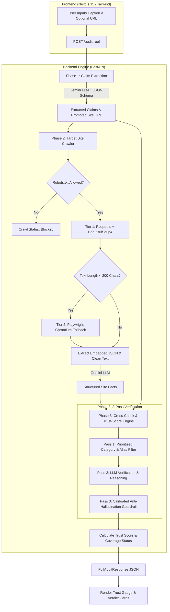

# ReelClaim

[](https://github.com/SumitMahajan11/ReelClaim/actions/workflows/test.yml)

ReelClaim is an automated claim verification and credibility auditing system for social media promotional reels and captions. By taking raw post captions (e.g., from Instagram Reels, TikTok, or YouTube Shorts), ReelClaim automatically extracts specific promotional promises—such as free course access, money-back refund policies, job guarantees, or pricing offers—discovers the promoter's official landing page, and crawls target site pages to extract ground-truth facts. It then cross-checks each extracted claim against source site facts using a multi-pass verification engine with anti-hallucination guardrails, producing a detailed per-claim verdict (confirmed, contradicted, partial, or not_found) alongside an aggregate trust score.

---

## Deployment & Quick Start

[](https://render.com/deploy?repo=https://github.com/SumitMahajan11/Instafake)
[](https://vercel.com/new/clone?repository-url=https://github.com/SumitMahajan11/Instafake&root-directory=reelclaim-frontend)

### Quick Start with Docker Compose

1. Clone the repository and copy the environment template:
   ```bash
   cp .env.example .env
   ```
2. Open `.env` and fill in your `GEMINI_API_KEY`.
3. Start all services (`reelclaim-backend`, `reelclaim-frontend`, and PostgreSQL):
   ```bash
   docker compose up -d
   ```
4. Access the web interface at `http://localhost:3000` and backend API docs at `http://localhost:8000/docs`.

---

## Architecture & 3-Phase Pipeline

ReelClaim consists of two core services: **`reelclaim-backend`** (Python 3.13, FastAPI, Pydantic v2, Playwright, BeautifulSoup4, `google-generativeai`) and **`reelclaim-frontend`** (Next.js 15, TypeScript, Tailwind CSS).

The audit pipeline operates across 3 sequential phases:



### Pipeline Overview
1. **Phase 1 (Claim Extraction)**: Receives the reel caption, uses Google Gemini (`gemini-3.5-flash-lite`) with structured JSON output schemas to identify any promoted website URL and extract specific claim items across standard categories (`price`, `discount`, `refund`, `certificate`, `eligibility`, `deadline`, `salary`, `partnership`, `other`).
2. **Phase 2 (Site Crawler)**: Validates `robots.txt` compliance and crawls up to 5 key site pages (`home`, `pricing`, `terms`, `faq`, `registration`, `refund_policy`). It utilizes a two-tier fetching strategy:
   - **Tier 1 (Requests + BS4)**: Parses standard HTML and embedded JSON scripts (`__NEXT_DATA__`, `__NUXT_DATA__`, `application/ld+json`).
   - **Tier 2 (Playwright Chromium Fallback)**: Automatically triggered if Tier 1 encounters a client-rendered JavaScript SPA shell (< 200 text characters). Playwright executions are guarded by a singleton process manager, concurrency thread lock, memory limit circuit breaker, and timeout controls.
   - Structured facts are extracted per page via Gemini.
3. **Phase 3 (Cross-Check & Trust Score Engine)**:
   - **Pass 1 (Category & Alias Match)**: Pairs claims with candidate facts using category hierarchy and fallback aliases to prevent shadowing.
   - **Pass 2 (LLM Verification)**: Generates preliminary verdicts and evidence quotes via Gemini with strict system instruction boundaries and untrusted data tags.
   - **Pass 3 (Anti-Hallucination Guardrail)**: Programmatically validates quoted evidence against source facts. If evidence introduces unsupported critical qualifiers (e.g., "no questions asked", "unconditional") or fails token overlap and string similarity thresholds, the verdict is overridden to `not_found`.
   - **Score Calculation**: Computes an aggregate trust score based on addressed claims (`confirmed` = 1.0, `partial` = 0.5, `contradicted` = -1.0). Returns `null` (`unverified_no_data`) if no claims are addressed by crawled site facts.

---

## Environment Variables Reference

| Variable | Required | Default | Description |
| :--- | :--- | :--- | :--- |
| `GEMINI_API_KEY` | Optional* | - | Google Gemini API key (*required for server-side single-user mode unless clients pass per-request BYOK key). |
| `GEMINI_MODEL` | Optional | `gemini-3.5-flash-lite` | Gemini model identifier used for extraction and claim verification. |
| `DATABASE_URL` | Optional | - | PostgreSQL connection string for audit result persistence. If unset, runs in stateless mode. |
| `REQUIRE_AUTH` | Optional | `false` | Set to `true` to require `X-API-Key` headers and enforce sliding-window rate limits. |
| `PORT` | Optional | `8000` | Port for the FastAPI backend service. |
| `NEXT_PUBLIC_API_URL` | Required | `http://localhost:8000` | Base URL of the backend API used by the Next.js frontend application. |

---

## Local Setup Instructions (Without Docker)

### Prerequisites
- **Python**: 3.11 or 3.13+
- **Node.js**: v18+ or v20+ (with `npm`)
- **Google Gemini API Key**: Obtainable from Google AI Studio

### 1. Backend Setup & Run (`reelclaim-backend`)

1. Navigate to the backend directory:
   ```bash
   cd reelclaim-backend
   ```
2. Create and activate a virtual environment:
   ```bash
   python -m venv venv
   # On Windows:
   venv\Scripts\activate
   # On macOS/Linux:
   source venv/bin/activate
   ```
3. Install Python dependencies:
   ```bash
   pip install -r requirements.txt
   ```
4. Install Playwright Chromium browser binaries:
   ```bash
   python -m playwright install chromium
   python -m playwright install-deps chromium
   ```
5. Start the FastAPI development server:
   ```bash
   uvicorn app.main:app --reload --port 8000
   ```
   The backend service will be live at `http://localhost:8000`. OpenAPI documentation is available at `http://localhost:8000/docs`.

### 2. Frontend Setup & Run (`reelclaim-frontend`)

1. Open a second terminal and navigate to the frontend directory:
   ```bash
   cd reelclaim-frontend
   ```
2. Install Node modules:
   ```bash
   npm install
   ```
3. Start the Next.js development server:
   ```bash
   npm run dev
   ```
   The frontend UI will be accessible at `http://localhost:3000`.

---

## Running Test & Benchmark Suites

Run the full backend test suite using `pytest`:
```bash
cd reelclaim-backend
pytest -v
```

Run the Phase 3 accuracy benchmark suite (50 labeled test cases):
```bash
cd reelclaim-backend
python tests/run_benchmark.py
```

---

## License

This project is licensed under the MIT License - see the [LICENSE](LICENSE) file for details.
